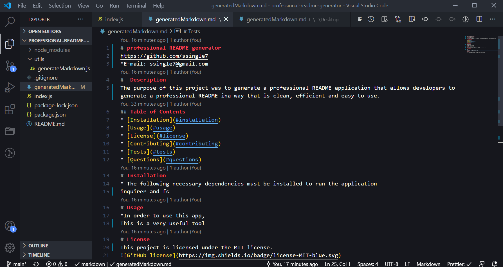

# professional-readme-generator

The purpose of this project was to generate a professional README application that allows developers to generate a professional README ina way that is clean, efficient and easy to use. 

-Inquirer and Fs packages were both used to obtain the data and process this in node js . 

-An array of questions was used to obtain the user input and a function was then added to input that user data and generate the README file. 

-Destructing the objects was inputted to create a return of the users input. 

-Function init was the task performed to initialize the application. 

 # Installation

To run this locally, use node js in the terminal.  

## Usage

To run this locally, use node js in the terminal. 

### Mock Up 

link to walk through video: https://drive.google.com/file/d/1k0duHRSDfXud_fUaDU-posUJjMJeIbiJ/view?usp=sharing

### Credits

* Used Inquirer package from https://www.npmjs.com/package/inquirer.

* nodejs.org documentation 

* 02-ask-the-class  

### Moc-Up

### License 

Copyright (c) [2020] [Selena Singleton]

Permission is hereby granted, free of charge, to any person obtaining a copy
of this software and associated documentation files (the "Software"), to deal
in the Software without restriction, including without limitation the rights
to use, copy, modify, merge, publish, distribute, sublicense, and/or sell
copies of the Software, and to permit persons to whom the Software is
furnished to do so, subject to the following conditions:

The above copyright notice and this permission notice shall be included in all
copies or substantial portions of the Software.

THE SOFTWARE IS PROVIDED "AS IS", WITHOUT WARRANTY OF ANY KIND, EXPRESS OR
IMPLIED, INCLUDING BUT NOT LIMITED TO THE WARRANTIES OF MERCHANTABILITY,
FITNESS FOR A PARTICULAR PURPOSE AND NONINFRINGEMENT. IN NO EVENT SHALL THE
AUTHORS OR COPYRIGHT HOLDERS BE LIABLE FOR ANY CLAIM, DAMAGES OR OTHER
LIABILITY, WHETHER IN AN ACTION OF CONTRACT, TORT OR OTHERWISE, ARISING FROM,
OUT OF OR IN CONNECTION WITH THE SOFTWARE OR THE USE OR OTHER DEALINGS IN THE
SOFTWARE.